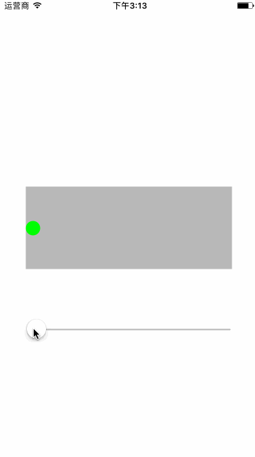
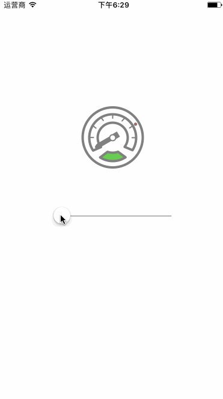
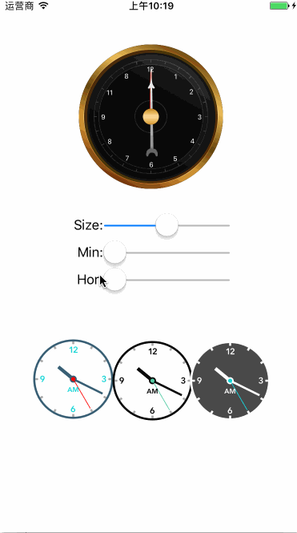
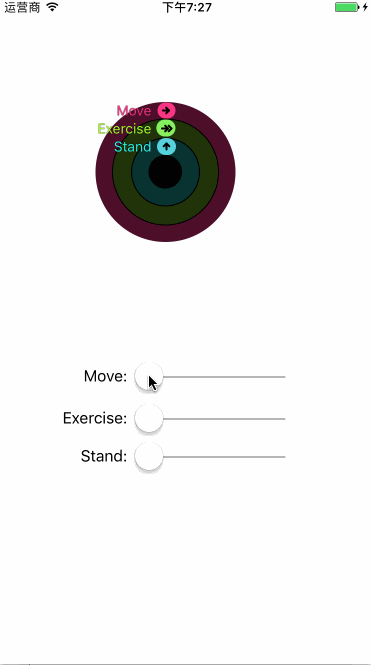
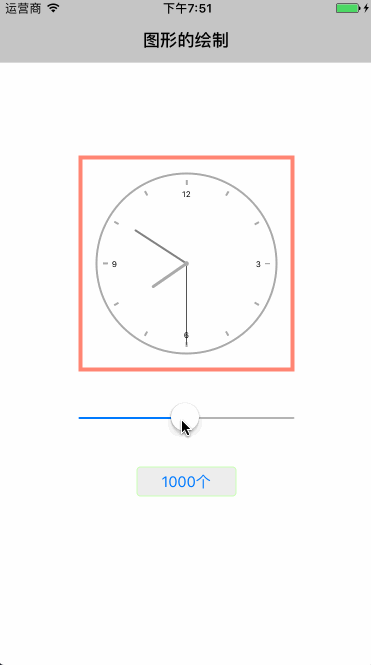

# PaintCodeSamples
===========
基于swift使用PaintCode 和 QuartzCode做的一些小程序

LWPieChart
-------
## 饼图

LWProgressBar
-------
## 进度条

StyleKitDemo
-------
## 自定义绘制

ButtonView
-------
## 自定义按钮

SinMotion
-------
## 正弦运动

DashBoard
-------
## 仪表盘

ClockBoard
-------
## 时钟表

ActivityBoard
-------
## 环形进度条

GraphicDraw
-------
## 图形绘制详解 

